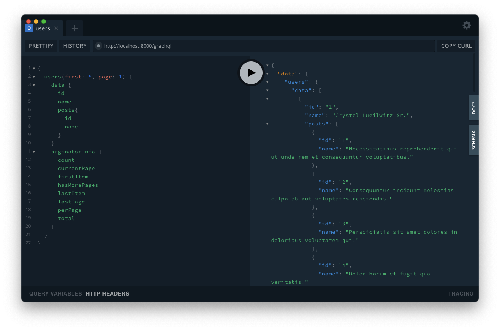

<p align="center"><a href="https://laravel.com" target="_blank"></a></p>

### Create database file
```touch database/database.sqlite```

### Copy and create environment file
```cp .env.example .env```

### Change your database for sqlite
```
DB_CONNECTION=sqlite
#DB_HOST=127.0.0.1
#DB_PORT=3306
#DB_DATABASE=laravel
#DB_USERNAME=root
#DB_PASSWORD=
```

## Eloquent base Graphql Example

Download Graphql Playground as you [here](https://github.com/graphql/graphql-playground/releases).



### Request Body
You can change all fields what you want to see on your response.
```graphql
{
  users(first: 5, page: 1) {
    data {
      id
      name
      posts{
        id
        name
      }
    }
    paginatorInfo {
      count
      currentPage
      firstItem
      hasMorePages
      lastItem
      lastPage
      perPage
      total
    }
  }
}
```
#
### And my graphql schema as you can see.
#### ```graphql/schema.graphql```
```graphql
type User {
    id: ID!
    name: String!
    email: String!
    posts: [Post!]! @hasMany
}

type Post {
    id: ID!
    name: String!
    content: String!
    user: [User!]! @belongsTo
}

type Query {
    allUsers: [User!]! @all
    users: [User!]! @paginate
    posts: [Post!]! @paginate
}
```
